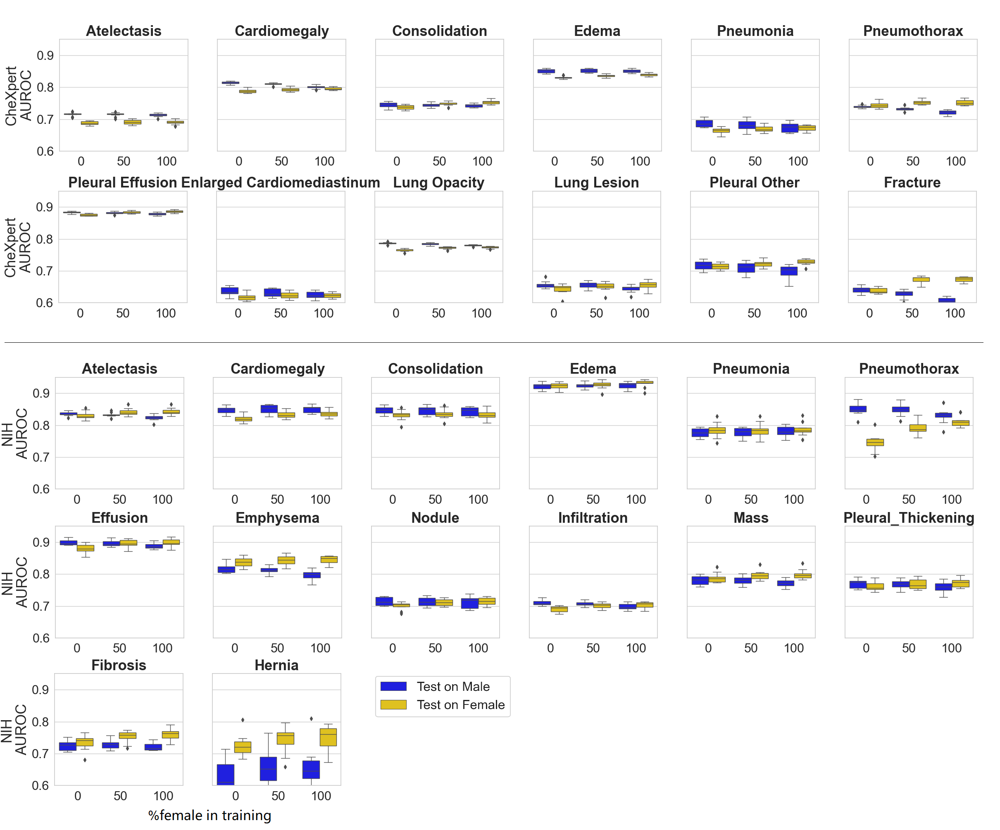

# Detecting the Causes of Gender Bias in Chest X-ray Diagnosis

Code repository for 2023 MICCAI workshop FAIMI paper: [Are Sex-based Physiological Differences the Cause of Gender Bias for Chest X-ray Diagnosis?](https://arxiv.org/abs/2308.05129)

## Enviroment Set-up

The code repo should be functioning well under `python==3.9.11`.

Create a new conda enviroment:  
`conda create -n detecting_causes python=3.9.11 `

Install the packages in requirements.txt:  
`conda install -f requirements.txt`

## Datasets

Both datasets are available online.  
For a easy way to download it:
* NIH: [link](https://nihcc.app.box.com/v/ChestXray-NIHCC). Download it and unzip it based on its instructions.
* CheXpert: [link](https://stanfordaimi.azurewebsites.net/datasets/8cbd9ed4-2eb9-4565-affc-111cf4f7ebe2). 
  * A smaller version on Kaggle: [link](https://www.kaggle.com/datasets/ashery/chexpert): resized image. 
  Which does not matter that much for this work, as we will resize it to 224 x 224 when preprocessing. 
  Need to mention here that resizing the image will definitely influence the prediction ability; however, in this work, 
  we care more about the performance gap between groups rather than getting better performance. 
  * Notice that we only use the frontal images (include PA and AP view position) in this work.

## Preprocessing

### 1. mata data
Mata data has already been processed, please refer to `chexpert.sample.allrace.csv` (CheXpert) and 
`Data_Entry_2017_v2020_clean_cplit.csv` (NIH).

### 2. images
run the following command to pre-process the images (resize).  
`python3 ./preprocess/preprocimgs.py -p {your dataset path}`

## Training
Command example for training NIH dataset on label Pneumothorax with resampling strategy with random state from 0 to 10, 
0, 50 and 100 female percentage in training:  

First, go to the `predction` folder:  
`cd ./prediction/`  

`python3 ./disease_prediction.py -s NIH -d Pneumothorax -f 0 50 100 -n 1 -r 0-10 -p {your dataset folder path}`  

Train on CheXpert:    
`python3 ./disease_prediction.py -s chexpert -d Pneumothorax -f 0 50 100 -n 1 -r 0-10 -p {your dataset folder path}`  

Train on different disease labels sequently:   
`python3 ./disease_prediction.py -s NIH -d Pneumothorax Pneumonia Cadiomegaly -f 0 50 100 -n 1 -r 0-10 -p {your dataset folder path}`

Details about the other hyper-parameters could be found in the same py file.

*Sampling actually takes quite a time:*
#TODO: prepare the splits for different random states as csv in `./datafiles/`

## Plotting the results

For plotting all the disease after re-store the results into csv file:  
`python3 ./analysis/plotting.py -p {your run result dir path}`

(*Well, you need to edit the image a bit to make it like this;)*)

## Detecting the Causes
### 1. Representation Bias (Imbalance Dataset)

See above `Plotting the results`.

### 2. Feature Bias (Breast shadows)

To run the experiments with cropped images:  
`python3 ./prediction/disease_prediction.py -s NIH -d Pneumothorax -f 0 50 100 -n 1 -r 0-10 --crop 0.6 -p {your dataset folder path}`

Notice that this part of experiment does not apply to CheXpert.

### 3. Label Errors 
#### 3.1 change the sampling strategies
* Without prioritizing the diseased one: #TODO
* Without sampling or sample more than one scans per patient: change the `-n` hyper-parameter:  
`python3 ./prediction/disease_prediction.py -s NIH -d Pneumothorax -f 0 50 100 -n None -r 0-10 -p {your dataset folder path}`
* Change the prevalence setting: `--prevalence_setting total` or `--prevalence_setting equal`

#### 3.2 cross sampling strategies experiments: run which py

1) Save model parameters:
`python3 ./prediction/disease_prediction.py -s NIH -d Pneumothorax -f 0 50 100 -n None -r 0-10 -p {your dataset folder path} --save_model True`
2) Run the cross dataset inference:
`python3 ./analysis/cross_ds_inference.py -d Penumothorax --run_dir {your run dir} --data_dir {your dataset dir}`

